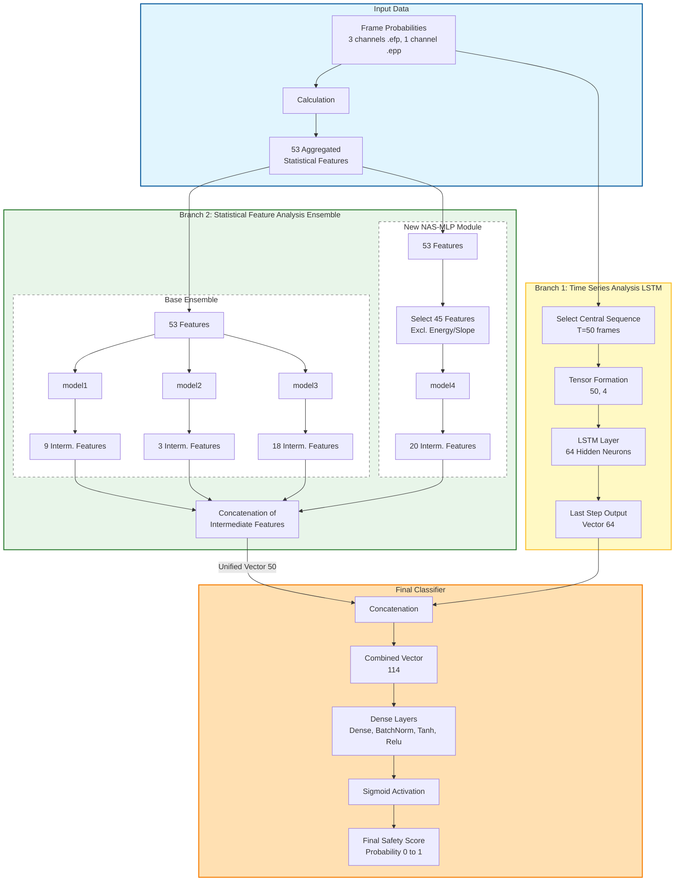
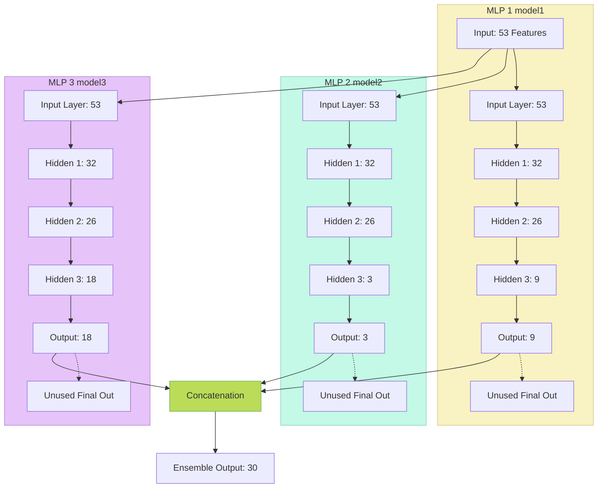

# EmotionLib
### Efficient Library for Media Content Analysis
[](https://gitverse.ru/kill/emotionlib)


**EmotionLib** is a robust C library designed for media content analysis. It identifies and blocks unsafe content while enhancing recommendations for safe media. By classifying content and analyzing emotional tone, solution provides deeper insights into media sentiment and ensures a safer, more engaging user experience.

The library is optimized for high performance and compatibility with various architectures, including **x86_64**, **ARM**, and **E2K (Elbrus)**.

---

## 🏆 Awards & Mentions

*   **BRICS Awards 2024**
*   **Softpedia**: [Editor's Review](https://www.softpedia.com/get/Multimedia/Video/Video-Players/EmotionPlayer.shtml)
*   **ITMO AI Showcase**: [Project Page](https://ai.itmo.ru/projects)

---

## 🏗 System Architecture

The core logic consists of hybrid neural networks combining Convolutional Neural Networks (CNNs) for frame analysis and LSTM/MLP ensembles for temporal aggregation.

### Hybrid Model Pipeline (SAMP Component)

The following diagram illustrates how frame probabilities are aggregated and processed through parallel LSTM and MLP branches to produce a final safety score.



### MLP Ensemble Architecture

Detailing the internal structure of the NAS-found MLP architectures used in the statistical branch.



### Low-Level Implementation Details

The library uses a pure C implementation of neural network layers to ensure portability (including Elbrus E2K compatibility) and performance. Below are examples of the core math operations used in `filter.dll`.

<details>
<summary><b>Click to view C Source Code Elements (Convolution & ReLU)</b></summary>

```c
#include <math.h>
#include "filter_activation.h"

/*
 * Operand:           Conv
 * Name: filtermodel/stem_conv/Conv2D
 * Description: Standard 3x3 Convolution with stride 2 (Stem layer)
 */
LIB_HIDDEN void node_filtermodel_stem_conv_Conv2D( const float x[1][3][224][224], const float w[32][3][3][3], const float bias[32], float y[1][32][112][112] )
{
    /* Conv
     * auto_pad: NOTSET
     * strides: 2 2 
     */
    for( uint32_t b=0; b<1; b++ ) {
        for( uint32_t m=0; m<32; m++) {
            for( int32_t o0=0, i0=-1; o0<112; o0++, i0+=2) {
                for( int32_t o1=0, i1=-1; o1<112; o1++, i1+=2) {
                    y[b][m][o0][o1] = bias[m];
                    for( int32_t c=0; c<3; c++ ) {
                        for( uint32_t k0=0; k0<3; k0++ ) {
                            for( uint32_t k1=0; k1<3; k1++ ) {
                                int ii0 = i0+k0 * 1;
                                if( ii0<0 || ii0>=224) continue;
                                int ii1 = i1+k1 * 1;
                                if( ii1<0 || ii1>=224) continue;
                                y[b][m][o0][o1] += x[b][c][ii0][ii1] *w[m][c][k0][k1];
                            }
                        }
                    }
                }
            }
        }
    }
}

/*
 * Operand:           Relu
 * Name: filtermodel/stem_relu/Relu
 * Description: Rectified Linear Unit activation
 */
LIB_HIDDEN void node_filtermodel_stem_relu_Relu( const float X[1][32][112][112], float Y[1][32][112][112] )
{
    float *X_ptr = (float*)X;
    float *Y_ptr = (float*)Y;
    for( uint32_t i=0; i<401408; i++ )
        Y_ptr[i] = X_ptr[i] > 0 ? X_ptr[i] : 0;
}

/* 
 * Additional implementations (GlobalAveragePool, Sigmoid, etc.) are 
 * included in the source files to ensure dependency-free compilation.
 */
```
</details>

---

## 🚀 Integration Examples

### 1. Comprehensive C Integration Tester
A complete, compile-ready example `tester/main.c` is provided in the repository. This tester serves as:
1.  **Integration Example**: Shows how to load DLLs/SOs and run the pipeline.
2.  **Platform Validator**: Used to verify compatibility on **Elbrus** and **Baikal** platforms.
3.  **Performance Benchmark**: Simulates long-running video processing.

**Location:** [`tester/main.c`](https://github.com/EmotionEngineer/EmotionLib/blob/master/tester/main.c)

**Compilation:**
```bash
# Linux / Elbrus / Baikal
gcc tester/main.c -o tester -ldl -lpthread -lm

# Windows (MinGW)
gcc tester/main.c -o tester.exe
```

**Running:**
```bash
./tester
```

### 2. C# / .NET Integration Snippets
For .NET developers, use P/Invoke to call the unmanaged libraries.

```csharp
// Import for Safety Analysis (SAMP)
[DllImport("samp.dll", CallingConvention = CallingConvention.Cdecl)]
public static extern double predictSAMP(string epp_path, string efp_path);

// Import for Frame Inference (Filter)
[DllImport("filter.dll", CallingConvention = CallingConvention.Cdecl)]
public static extern void filter_VideoInference([In, Out] float[,,,] frames, int num_frames, [In, Out] float[,] results, IntPtr progress);
```

---

## 🧪 Model Training & Reproducibility

We provide Jupyter notebooks and datasets to reproduce the training of the classification heads. 
*Note: The original raw video datasets are not distributed due to legal/safety restrictions. Feature extraction vectors are provided instead.*

### 1. Emotional Analysis (Positiveness)
The `positiveness.dll` module achieves **99.58% Accuracy** and **0.9999 AUC** on validation, ensuring high-precision emotional context detection.

*   **Training Notebook:** [Kaggle: EmotionLib Positiveness Train](https://www.kaggle.com/code/saicourse/emotionlib-positiveness-train)
*   **Accuracy:** >99% (Validated)

### 2. Safety Filter (NSFW/Gore)
The core safety mechanism using LSTM and NAS-MLP ensembles.

*   **Training Notebook:** [Kaggle: Filter Train (Additional Features)](https://www.kaggle.com/code/saicourse/emotionlib-filter-train-additional-features/)
*   **Dataset:** [EmotionLib Media Filter Dataset (Extended Intermediate)](https://www.kaggle.com/datasets/saicourse/emotionlib-media-filter-dataset-extended-inter)
    *   *Contains:* Pre-computed feature vectors from `filter` and `positiveness` for >8000 videos.

### 3. MPAA Rating Prediction
Multiclass classification for G, PG, PG-13, R ratings.

*   **Training Notebook:** [Kaggle: MPAA Train](https://www.kaggle.com/code/saicourse/emotionlib-mpaa-train)
*   **Dataset:** [EmotionLib MPAA Rating Dataset](https://www.kaggle.com/datasets/saicourse/emotionlib-mpaa-rating-dataset)

---

## 🛠 Building the Library

1.  **Clone & Setup:**
    ```bash
    git clone https://github.com/EmotionEngineer/EmotionLib.git
    ```
2.  **Download Weights:**
    Download `weights_headers.zip` from [Releases](https://github.com/EmotionEngineer/EmotionLib/releases) and extract `*_weights.c` to `filter/` and `positiveness/` folders.
3.  **Compile:**
    ```bash
    cd EmotionLib/filter && make CFLAGS=-fno-lto
    cd ../positiveness && make CFLAGS=-fno-lto
    cd ../samp && make
    ```

## 📜 License

EmotionLib is released under the **MIT License**. See the `LICENSE` file for details.
